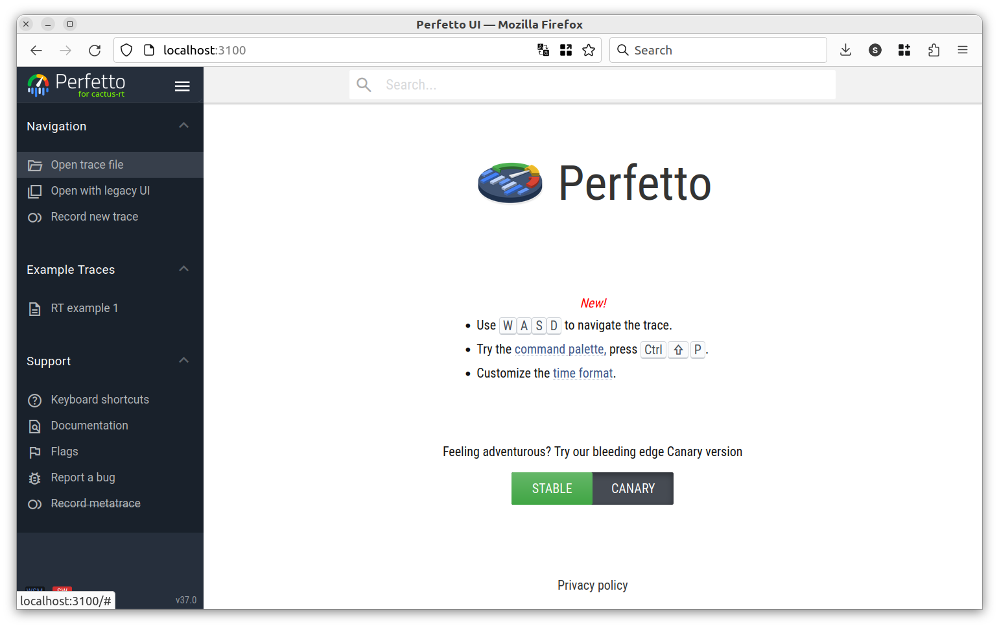
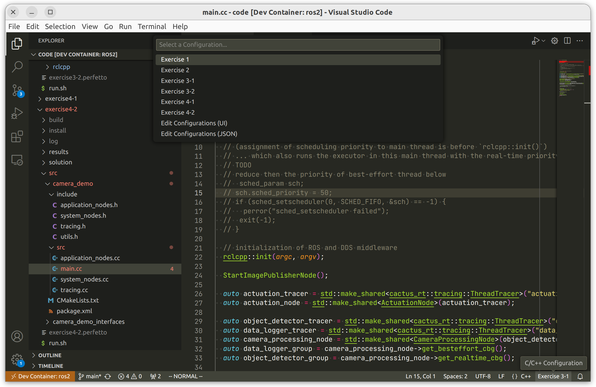

Real-time programming with ROS 2
================================

This is the repository for the `Real-time programming with ROS 2` workshop for
ROScon 2023.

Workshop setup for laptops
--------------------------

To get the most out of the workshop, please complete the setup instructions for
your laptop ahead of time. This will take about 10-20 minutes of your time and
hopefully will make the workshop go significantly smoother. If you run into any
problems, please [file an issue in this
repository](https://github.com/ros-realtime/roscon-2023-realtime-workshop/issues).

### System requirements

The workshop code **only supports Linux**. Officially, we only test **Ubuntu
22.04** as the laptop/development operating system. However, with the Docker
setup described below, it may be possible to run this on other Linux variants,
although this is untested.

**A real-time kernel is not necessary**, although you may see decreased maximum
latency numbers if you have a real-time kernel. For reference, the workshop code
is developed on regular Ubuntu kernels.

**Docker for Mac and Docker for Windows are not supported. Please try to bring a
Linux laptop to the workshop for best results.**. It is possible that a virtual
machine running on Linux may work for you, although this is also not supported.

**Podman is not supported**. It might work, but we have not tested the Docker
setup below with Podman.

The code is tested on both `amd64` and `arm64` (via the Raspberry Pi 4). No
tests are made against the M1/M2 Macbooks.

### Using Docker

The simplest way to run the workshop code is to use the workshop-specific Docker
image. To get the Docker image, there are two options: (1) getting the image
before the workshop **(highly recommended)**, or (2) getting the image during
the workshop (we cannot guarantee this experience will be good due to
constraints of networking during a conference).

Before getting the image, you must install Docker Engine on your Linux machine.
Please follow the [Docker Engine installation instructions][docker-install].
**Ensure you do not use Docker Desktop as that is not supported due to its use
of a virtual machine**. At the end, you should confirm that you see the
following output when running the following commands:

```console
$ docker version | grep -A2 Client
Client: Docker Engine - Community
 Version:           24.0.6
 API version:       1.43

$ docker version | grep -A2 Server
Server: Docker Engine - Community
 Engine:
  Version:          24.0.6
```

The exact version of Docker may be different than the above output.

You must also install Docker such that you can manage docker without root. [See the instruction here for details](https://docs.docker.com/engine/install/linux-postinstall/#manage-docker-as-a-non-root-user).

[docker-install]: https://docs.docker.com/engine/install/ubuntu/

### Getting the image BEFORE the workshop

1. Download the image file from [the latest release](https://github.com/ros-realtime/roscon-2023-realtime-workshop/releases/latest). The file is called `docker-image.tar.gz`.
2. Clone the [roscon-2023-realtime-workshop](https://github.com/ros-realtime/roscon-2023-realtime-workshop) repository with `--recursive` option: `git clone --recursive https://github.com/ros-realtime/roscon-2023-realtime-workshop.git`.
3. `cd` into the `roscon-2023-realtime-workshop` repository.
4. `docker/fetch ~/Downloads/docker-image.tar.gz`.

This should import the Docker image with a name of `roscon-2023-realtime-workshop`.

Note: do **NOT** use `docker import` or `docker load`. Please use the
`docker/fetch` script above.

### Starting the Docker container

**If you would like to use VS Code and its dev container system, you can skip this section and go directly to [Using Visual Studio Code](#using-visual-studio-code).**

After importing the Docker image, you can start the Docker container via the
special shell file [`docker/start`](docker/start):

1. `cd` into this repository.
2. `docker/start`

This should start the Docker container and it will mount this repository into the
`/code` directory inside the container. As a result, changes to the repository
in the host will be reflected in the container.

This should start the Docker container with all of the appropriate privileges to
run real-time-scheduled applications. It also setup the container with
everything needed to run GUI programs.

### Log into the Docker container

After starting the Docker container, you can login to the Docker container using
the special [`docker/shell`](docker/shell) script:

1. `cd` into this repository.
2. `docker/shell`

You should be greeted with something like the following:

```
To run a command as administrator (user "root"), use "sudo <command>".
See "man sudo_root" for details.

user@6896a5d8dd84:/code$
```

This script logs you into an user named `user` which has the same UID and GID as
your host user. This eliminates some of the permission errors you may encounter
with using Docker. It also allows you to run GUI programs.

### Checking everything works

After logging into the Docker container, you should check everything works:

**Check the trace viewer tools are available**

1. After starting the Docker container, open a browser.
2. Navigate to http://localhost:3100.
3. Ensure a webpage like the following screenshot loads up.



**Make sure all exercises compile and exercise 1 runs**

After logging into the Docker container:

```console
$ cd /code/exercise1 && colcon build
$ cd /code/exercise2-1 && colcon build
$ cd /code/exercise2-2 && colcon build
$ cd /code/exercise3-1 && colcon build
$ cd /code/exercise3-2 && colcon build
$ cd /code/exercise4-1 && colcon build
$ cd /code/exercise4-2 && colcon build
```

Make sure these all build. Then make sure at least exercise 1 runs (which takes
10 seconds):

```console
$ cd /code/exercise1
$ install/latency_tester/bin/latency_tester
Testing latency for 10 seconds with 2 threads...
Latency testing complete. Trace file available at: exercise1.perfetto
```

You can load the `exercise1.perfetto` file in the trace viewer that you checked
above and see some data being plotted.

**Check rviz2 is working**

After logging into the Docker container, run:

```console
$ rviz2
```

The usual rviz2 GUI window should show up if all is well.

### Using Visual Studio Code

If you like to use VS code for development, you must install the [Remote Development Extension Pack](https://marketplace.visualstudio.com/items?itemName=ms-vscode-remote.vscode-remote-extensionpack), which enables the dev container system.

This repository contains a [`.devcontainer`](.devcontainer) setup. This setup
relies on the image imported above using the `docker/fetch` script. So if you
haven't performed the [image import
step](#getting-the-image-before-the-workshop), launching VS
code with dev containers will not work as it will fail to find the image.

Once you [imported the image](#getting-the-image-before-the-workshop), you can simply open VS code with dev containers in this repository. You can use the VS code terminal or use the `.devcontainer/shell` script to login to the container. All above features should work and you should check.

**Getting IntelliSense to work**

To get IntelliSense to work with the C++ extension, you must select the appropriate build configuration for each exercise with the button on the bottom right side of your status bar, as indicated by the following screenshot:



You also have to build the code for that exercise at least once via `colcon build`. Sometimes, a Reload Window command is needed (CTRL+P -> `Developer: Reload Window`) to make IntelliSense work fully.

Workshop setup for the Raspberry Pi 4
-------------------------------------

We will have a limited number of Raspberry Pi 4s to loan to attendees. We
expect people to form groups of 3-5 to work on problems together. That said, we
welcome you to bring your own Raspberry Pi 4s as well. We recommend the
following hardware:

- A Raspberry Pi 4 (4GB+ is recommended, 2GB may be OK)
- An Ethernet cable and any necessary USB Ethernet adapters to connect the Raspberry Pi directly to your laptop
- A microSD card with greater than 8GB
- The Raspberry Pi 4 power supply with USA power plugs

### Before the workshop: flashing the image

A specially-crafted image designed for the workshop must be flashed to the SD
card. This image contains an Ubuntu 22.04 installation with ROS 2 humble and a
real-time kernel which is based on [the Raspberry Pi 4 image maintained by the
ROS 2 real-time working group](https://github.com/ros-realtime/ros-realtime-rpi4-image).
It has the code of the exercises builtin and has all of the dependencies
installed, to ensure the experience can be had entirely offline. It also
contains a number of helper utilities designed to make it easier for attendees
for the workshop.

To download the image, go to the [latest
release](https://github.com/ros-realtime/roscon-2023-realtime-workshop/releases/latest).
Download the `roscon2023-rt-workshop-rpi4-ubuntu-22.04.1-ros2-humble.img.zst`.
This is a [zstd-compressed](https://en.wikipedia.org/wiki/Zstd) file to save
space. You should be able to double click it and extract the image file.
Alternatively, you can use the command:

```
$ unzstd roscon2023-rt-workshop-rpi4-ubuntu-22.04.1-ros2-humble.img.zst
```

Locate a microSD card with greater than 16GB of storage and use
[Etcher](https://etcher.balena.io/) to flash the resulting image file to your
microSD card.

#### Directly flashing the image in one command

Alternatively, you can also use the command:

```
$ unzstd roscon2023-rt-workshop-rpi4-ubuntu-22.04.1-ros2-humble.img.zst --stdout | sudo dd of=/dev/sdX bs=16M conv=fdatasync oflag=direct
```

Please replace the `/dev/sdX` with the appropriate device.

### Starting and connecting to the Raspberry Pi 4

Start the Raspberry Pi normally. You do not need to attach a monitor or a
keyboard. To connect to the Raspberry Pi:

1. Connect the Ethernet to the Raspberry Pi 4's only Ethernet port.
2. Connect the other end of the Ethernet to your laptop. You may have to do this via an USB Ethernet adapter if you do not have an Ethernet port directly on your laptop.
3. Wait briefly for the Raspberry Pi 4 to boot up and your laptop to connect to the network. This may take a few minutes on first boot.
4. Once connected, the Raspberry Pi 4 is accessible at the IP address `192.168.10.1`.
5. You can `ssh ubuntu@192.168.10.1`. The password is **`ubuntu`**.
6. The code for the exercises is located in the `/code` path.`

### Run the pre-built exercise 1

The image contains not only the source code, but also pre-built binaries for
all the exercises. This is to reduce the amount of time needed to build during
the workshop. Please check this is working by running exercise 1:

1. Log in to the Raspberry Pi using the instructions above.
2. `cd /code/exercise1`
3. `./run.sh`

You may see warnings about loop overruns. This is expected as part of the
exercise is to resolve this. 

This program will generate a trace file located at
`/code/exercise1/exercise1.perfetto`. You can download it via `scp` or use the
browser as documented below.

### Connect to the Raspberry Pi 4's builtin HTTP server to download files

The image contains a built-in HTTP server where you can browse the `/code`
directory located on the Pi. This allows you to more easily download trace
files, which we will do during the workshop. Please check this is working ahead
of time:

1. With Ethernet connected to the Raspberry Pi, go to
   http://192.168.10.1/repo/.
2. Click into `exercise1` and download `exercise1.perfetto` (this will only
   exists if you ran exercise 1 as instructed in the above section).
3. Go to http://192.168.10.1/perfetto/
4. On the top left of the screen, click `Open trace file` and open the
   `exercise1.perfetto` file you just downloaded.
5. A timeline view should show up. You can press `W` on your keyboard to zoom
   in. Press `?` to get help on how to use the interface if you would like to
   explore further.
