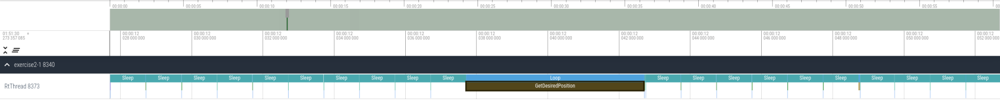

`Inverted Pendulum`
===================

These packages serves as a demo inverted pendulum. The pendulum is kept upright by a PID controller.

# Basic Usage

## Build

Change directories to this folder and build:
```bash
cd exercise2-1
colcon build
```

## Launch

If your computer supports graphics, you can run the following command to start the pendulum demo with RViz:

```bash
./run.sh
```

You should see something like the following, with the pendulum oscillating back and forth with a period of about 6 seconds:


You may also see a lot of `loop overrun detected` messages in the terminal. This is expected.

In the original terminal where you started exercise2-1, stop the program by pressing CTRL + C.

## Interaction

You can interact with the inverted pendulum simulation with [ROS services](https://docs.ros.org/en/humble/Tutorials/Beginner-CLI-Tools/Understanding-ROS2-Services/Understanding-ROS2-Services.html).

For the purposes of exploring the interaction with the code, let's run exercise 2-3. You should see the same thing as you saw for exercise 2-1, except the pendulum will not oscillate. This will make it easier to visualize interactions with the pendulum.

```bash
cd exercise2-3
colcon build
./run.sh
```
### Reset the simulation

You can restart the pendulum simulation via the `/reset_pendulum` service. Restarting the simulation will reset the pendulum to its initial state (an initial position of 0.6 rad and initial velocity of 0.0 rad/s).

In a new terminal, run:

```bash
cd exercise2-3
source install/setup.bash
ros2 service call /reset_pendulum std_srvs/srv/Empty
```

You should see a small jump in the RViz visualization of the robot.

### Change the pendulum setpoint

You can change the pendulum setpoint via the `/set_desired_position` service. The following example sets the desired position for the pendulum to be 0.2 radians, where 0.0 radians is vertical. The setpoint should be between (-pi / 2, pi / 2), as the pendulum is restricted to those limits.

In a new terminal, run:

```bash
cd exercise2-3
source install/setup.bash
ros2 service call /set_desired_position inverted_pendulum_interfaces/srv/SetDesiredPosition "{desired_position: 0.2}"
```

You should see the pendulum in RViz slightly tilted.

### Change the PID constants

You can change the PID constants via the `/set_PID_constants` service. This example sets the PID constants all to 0, effectively disabling the control loop.

In a new terminal, run:

```bash
cd exercise2-3
source install/setup.bash
ros2 service call /set_PID_constants inverted_pendulum_interfaces/srv/SetPIDConstants "{kp: 0, ki: 0, kd: 0}"
```

You should see the pendulum fall to the ground.

### Stop the example

In the original terminal where you started exercise2-3, stop the program by pressing CTRL + C.

# Exercise 2-1: Single Data

This exercise covers how to pass single data between the real-time thread and the ROS thread.

In this exercise, we would like to set the desired pendulum position from the ROS thread. The desired pendulum position is specified by a singular scalar value.
Let's look at the [main function](./src/inverted_pendulum/src/main.cc) (`exercise2-1/src/inverted_pendulum/src/main.cc`) associated with this exercise. There's a `set_desired_positions_thread` that repeatedly calls `shared_context->desired_position.Set` to update the pendulum position.
In this case, we update the pendulum with a sinusoid that will cause the pendulum to oscillate back and forth with a period of about 6 seconds.

The position setting logic is in [single_data.h](./src/inverted_pendulum/include/inverted_pendulum/message_passing/single_data.h) (`exercise2-1/src/inverted_pendulum/include/inverted_pendulum/message_passing/single_data.h`). In this file, we have a `Set` method that the ROS thread uses to update `value_`, and a `Get` method that the real-time thread uses to read `value_`. Thread-safety is achieved using locks.

Let's run the example. First, run some stress. In the Docker container or on the Raspberry Pi, run:
```bash
/code/stress.sh
```

Alternatively, if not running in the Docker container, you can use this stress script from the top level of the repository:
```bash
path/to/repo/stress.sh
```

In another terminal, let's run the exercise:
```bash
cd exercise2-1
./run.sh
```

You should see RViz with the pendulum oscillating slowly. The PID controller output will be printed to the terminal every second. Loop overruns will also appear in the logs.

Stop running the program after several seconds. If you do not terminate the program, after 2 minutes, tracing will terminate to keep file sizes low. The stress test can also be stopped at this point.

This will generate a trace file called `exercise2-1.perfetto`. A sample result is included [here](./results/baseline.perfetto) (`exercise2-1/results/baseline.perfetto`). In the browser, open [Perfetto](http://localhost:3100). If not running the Docker container, you can also access [Perfetto here](https://cactusdynamics.github.io/perfetto/).

Click on `Open trace file` and open the `exercise2-1.perfetto` file.

Press `W` to zoom on the timeline until you find the `GetDesiredPosition` slice.
Find the largest slice by clicking on a slice, selecting the slice name in the bottom panel, selecting "Slices with the same name". This will show a list of all `GetDesiredPosition` slices. Click on the "Duration" header and "Sort: highest first" to show the worst latency at the top of the list. Click on the ID of that corresponding slice to automatically zoom into the slice.



Also click on `Latency` on the left side bar to view the latency histogram for the `RtThread`'s `GetDesiredPosition` slice:


Any slice taking longer than 1 ms causes a deadline miss. Observe the rightmost (largest) slice duration.

To resolve this, let's try using an atomic instead of a lock. In [single_data.h](./src/inverted_pendulum/include/inverted_pendulum/message_passing/single_data.h) (`exercise2-1/src/inverted_pendulum/include/inverted_pendulum/message_passing/single_data.h`), replace the `double` with a `std::atomic<double>`.
When using an atomic, be sure to check that the atomic is lock free with `static_assert(std::atomic<double>::is_always_lock_free)`. It's often convenient to put this line directly above the atomic.
Now that we are using an atomic, we should also remove the locks: remove the mutex in the private variables, and remove the locks in the `Set` and `Get` methods. 

Build your solution, stress, run the exercise again, and examine the new trace. Stressing will slow down the build process, so finish building before starting the stress test. Remember to stop the stress process after stopping the exercise.

The solution can be found [here](./solutions/single_data.h) (`exercise2-1/solutions/single_data.h`). Below are the example results for the solution using atomics (note that the histogram units are in nanoseconds rather than microseconds as above). The associated example trace file is [here](./results/solution.perfetto) (`exercise2-1/results/solution.perfetto`).


In the histogram, it may be necessary to use the dropdown to change the units to nanoseconds if the microseconds is not granular enough. The above histogram is in nanoseconds.


Observe the largest latency slice (`RtThread`'s `GetDesiredPosition`) and compare it with the previous result.

# Solutions and Results
Example trace files can be found in the [results folder](./results/). For all results, `stress-ng` was used to stress the CPUs. These results files were generated on a Raspberry Pi 4 with a real-time kernel. This image can be found [here](https://github.com/ros-realtime/ros-realtime-rpi4-image/releases/tag/22.04.3_v5.15.98-rt62-raspi_ros2_humble).

Solutions for this exercise can be found in the [solutions folder](./solutions/) (`exercise2-1/solutions`). The content of these files can be copy-pasted into the [single_data.h](./src/inverted_pendulum/include/inverted_pendulum/message_passing/single_data.h) (`exercise2-1/src/inverted_pendulum/include/inverted_pendulum/message_passing/single_data.h`) file. The provided solutions file was used to produce the included results.
