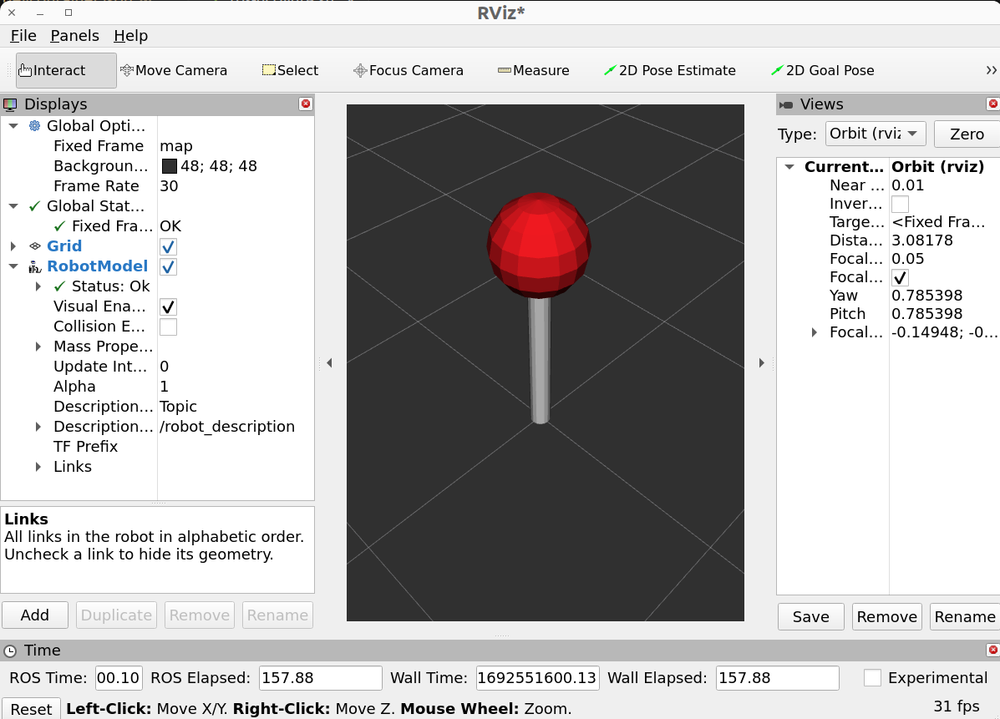
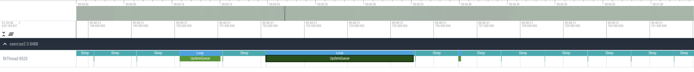

`Inverted Pendulum`
===================

These packages serves as a demo inverted pendulum. The pendulum is kept upright by a PID controller.

# Basic Usage

## Build

Change directories to this folder and build:
```bash
cd exercise2-3
colcon build
```

## Launch

If your computer supports graphics, you can run the following command to start the pendulum demo with RViz:

```bash
./run.sh
```

You should see something like the following:


You may also see a lot of `loop overrun detected` messages in the terminal. This is expected. Leave the demo running to try interacting with the pendulum in the next section.

## Interaction

You can interact with the inverted pendulum simulation with [ROS services](https://docs.ros.org/en/humble/Tutorials/Beginner-CLI-Tools/Understanding-ROS2-Services/Understanding-ROS2-Services.html).

### Reset the simulation

You can restart the pendulum simulation via the `/reset_pendulum` service. Restarting the simulation will reset the pendulum to its initial state (an initial position of 0.6 rad and initial velocity of 0.0 rad/s).

In a new terminal, run:

```bash
cd exercise2-3
source install/setup.bash
ros2 service call /reset_pendulum std_srvs/srv/Empty
```

You should see a small jump in the RViz visualization of the robot.

### Change the pendulum setpoint

You can change the pendulum setpoint via the `/set_desired_position` service. The following example sets the desired position for the pendulum to be 0.2 radians, where 0.0 radians is vertical. The setpoint should be between (-pi / 2, pi / 2), as the pendulum is restricted to those limits.

In a new terminal, run:

```bash
cd exercise2-3
source install/setup.bash
ros2 service call /set_desired_position inverted_pendulum_interfaces/srv/SetDesiredPosition "{desired_position: 0.2}"
```

You should see the pendulum in RViz slightly tilted.

### Change the PID constants

You can change the PID constants via the `/set_PID_constants` service. This example sets the PID constants all to 0, effectively disabling the control loop.

In a new terminal, run:

```bash
cd exercise2-3
source install/setup.bash
ros2 service call /set_PID_constants inverted_pendulum_interfaces/srv/SetPIDConstants "{kp: 0, ki: 0, kd: 0}"
```

You should see the pendulum fall to the ground.

### Stop the example

In the original terminal where you started exercise2-3, stop the program by pressing CTRL + C.

# Exercise 2-3

This exercise covers how to pass data in a queue between the real-time thread and the ROS thread.

The inverted pendulum position is calculated via a 1000 Hz simulation in the real-time thread. In this exercise, we would like to pass the pendulum positions from the real-time thread to teh ROS thread for visualization. The pendulum positions and timestamps associated with those positions are recorded in a queue.

Let's look at the [ROS thread](./src/inverted_pendulum/src/ros_pendulum_node.cc) (`exercise2-3/src/inverted_pendulum/src/ros_pendulum_node.cc)`) associated with this exercise. The ROS thread has a `TimerCallback` that periodically pops all data from the data queue at 100 Hz. The real-time thread pushes into this queue at 1000 Hz.

The position setting logic is in [data_queue.h](./src/inverted_pendulum/include/inverted_pendulum/message_passing/data_queue.h) (`exercise2-3/src/inverted_pendulum/include/inverted_pendulum/message_passing/data_queue.h`). In this file, we have an `EmplaceData` method that the real-time thread uses to push data into the queue, and a `PopData` method that the ROS thread uses to get values from the queue. Thread-safety is achieved using locks.

The `std::queue` used to store the pendulum positions does not have a `reserve()` method, so it may dynamically allocate memory during runtime, which is a cause of latency.

There's a `WasteTime` method within the locked portion of `PopData`. This function is here for the exercise purpose only, and it will busy loop for a given time. The `WasteTime` function is meant to cause lock contention, as popping data from a queue is generally fast, and lock contention is rare.  In reality, real-time reliability needs to be tested over long periods of time.
Ideally, we should minimize doing work while holding the lock. If work must be done, treat code in this section of the code as real-time.

Let's run the example. First, run some stress. In the Docker container or on the Raspberry Pi, run:
```bash
/code/stress.sh
```

Alternatively, if not running in the Docker container, you can use this stress script from the top level of the repository:
```bash
path/to/repo/stress.sh
```

In another terminal, run the exercise:
```bash
cd exercise2-3
./run.sh
```

You should see RViz with the pendulum being controlled by the PID controller to remain upright. The PID controller output will be printed to the terminal every second. Loop overruns will also appear in the logs.

Stop running the program after several seconds. If you do not terminate the program, after 2 minutes, tracing will terminate to keep file sizes low. The stress test can also be stopped at this point.

This will generate a trace file called `exercise2-3.perfetto`. A sample result is included [here](./results/baseline.perfetto) (`exercise2-3/results/baseline.perfetto`). In the browser, open [Perfetto](http://localhost:3100). If not running the Docker container, you can also access [Perfetto here](https://cactusdynamics.github.io/perfetto/).

Press `W` to zoom on the timeline until you find the `UpdateQueue` slice.
Find the largest slice by clicking on a slice, selecting the slice name in the bottom panel, selecting "Slices with the same name". This will show a list of all `UpdateQueue` slices. Click on the "Duration" header and "Sort: highest first" to show the worst latency at the top of the list. Click on the ID of that corresponding slice to automatically zoom into the slice.



Also click on `Latency` on the left side bar to view the latency histogram for the `RtThread`'s `UpdateQueue` slice:


Any slice taking longer than 1 ms causes a deadline miss. Observe the rightmost (largest) slice duration.

Now, let's try using a real-time safe queue. A lockfree queue implementation is available as a `moodycamel::ReaderWriterQueue`. In [data_queue.h](./src/inverted_pendulum/include/inverted_pendulum/message_passing/data_queue.h) (`exercise2-3/src/inverted_pendulum/include/inverted_pendulum/message_passing/data_queue.h`), change the `std::queue<OutputData>` to a `ReaderWriterQueue<OutputData>`. Now that we are using a lockfree queue, we should also remove the locks: remove the mutex in the private variables, and remove the locks in the `Set` and `Get` methods. 

We must pick a size for the lockfree queue. This size must be large enough such that the real-time thread does not fill the queue before the ROS thread can empty it. For the purposes of this exercise, `8'192` will be sufficient. Use `ReaderWriterQueue<OutputData>(8'192)` to set the size of the queue.

The `moodycamel::ReaderWriterQueue` has a `try_emplace(timestamp, output_value)` method that can be used to emplace data that is guaranteed to never allocate. It returns `true` if the element was emplaced, and `false` otherwise.

If we choose a queue size that is too small, the real-time thread will push data into the queue faster than the ROS thread can empty it. In this case, we will run out of room in the queue, and `try_emplace` will return false.
When writing real-time code, it is important to think about how the program should behave if the queue is full.
In this example, you can see that in the [real-time thread](./src/inverted_pendulum/src/rt_thread.cc), if we fail to push data into the queue, we drop the data.

Similarly, the `moodycamel::ReaderWriterQueue` has a `try_dequeue(data)` method that can be used to dequeue an element. It returns `false` if the queue is empty. This means we can remove the check if the queue is empty, and simply `return queue_.try_dequeue(data)`. Be sure to leave the `WasteTime` function in `PopData`.

Build your solution, stress, run the exercise again, and examine the new trace. Stressing will slow down the build process, so finish building before starting the stress test. Remember to stop the stress process after stopping the exercise.

The solution can be found [here](./solutions/data_queue.h) (`exercise2-3/solutions/data_queue.h`). Below are the example results for the solution using a lockfree queue (note that the histogram units are in nanoseconds rather than microseconds as above). The associated example trace file is [here](./results/solution.perfetto) (`exercise2-3/results/solution.perfetto`).


In the histogram, it may be necessary to use the dropdown to change the units to nanoseconds if the microseconds is not granular enough. The above histogram is in nanoseconds.


Observe the largest latency slice (`RtThread`'s `UpdateQueue`) and compare it with the previous result.

# Solutions and Results
Example trace files can be found in the [results folder](./results/). For all results, `stress-ng` was used to stress the CPUs. These results files were generated on a Raspberry Pi 4 with a real-time kernel. This image can be found [here](https://github.com/ros-realtime/ros-realtime-rpi4-image/releases/tag/22.04.3_v5.15.98-rt62-raspi_ros2_humble).

Solutions for all exercises can be found in the [solutions folder](./solutions/) (`exercise2-3/solutions`). The content of these files can be copy-pasted into the [data_queue.h](./src/inverted_pendulum/include/inverted_pendulum/message_passing/data_queue.h) (`exercise2-3/src/inverted_pendulum/include/inverted_pendulum/message_passing/data_queue.h`) file. The provided solutions file was used to produce the included results.
