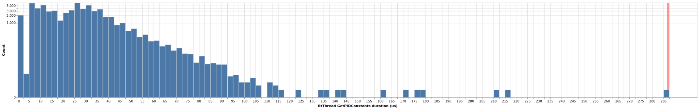
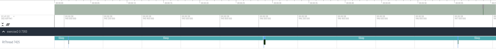

`Inverted Pendulum`
===================

These packages serves as a demo inverted pendulum. The pendulum is kept upright by a PID controller.

# Basic Usage

## Build

Change directories to this folder and build:
```bash
cd exercise2
colcon build
```

## Launch

If your computer supports graphics, you can run the following command to start the pendulum demo with RViz:

```bash
./run-exercise2-3.sh
```

You should see something like the following:


You will also see a lot of `loop overrun detected` messages in the terminal. This is expected.

## Interaction

You can interact with the inverted pendulum simulation with [ROS services](https://docs.ros.org/en/humble/Tutorials/Beginner-CLI-Tools/Understanding-ROS2-Services/Understanding-ROS2-Services.html).

### Reset the simulation

You can restart the pendulum simulation via the `/reset_pendulum` service. Restarting the simulation will reset the pendulum to its initial state (an initial position of 0.6 rad and inital velocity of 0.0 rad/s. ).

In a new terminal, run:

```bash
ros2 service call /reset_pendulum std_srvs/srv/Empty
```

You should see a small jump in the RViz visualization of the robot.

### Change the pendulum setpoint

You can change the pendulum setpoint via the `/set_desired_position` service. The following example sets the desired position for the pendulum to be 0.2 radians, where 0.0 radians is vertical. The setpoint should be between (-pi / 2, pi / 2), as the pendulum is restricted to those limits.

In a new terminal, run:

```bash
cd exercise2
source install/setup.bash
ros2 service call /set_desired_position inverted_pendulum_interfaces/srv/SetDesiredPosition "{desired_position: 0.2}"
```

You should see the pendulum in RViz slightly tilted.

### Change the PID constants

You can change the PID constants via the `/set_PID_constants` service. This example sets the PID constants all to 0, effectively disabling the control loop.

In a new terminal, run:

```bash
cd exercise2
source install/setup.bash
ros2 service call /set_PID_constants inverted_pendulum_interfaces/srv/SetPIDConstants "{kp: 0, ki: 0, kd: 0}"
```

You should see the pendulum fall to the ground.

### Stop the example

In the original terminal where you started exercise2-3, stop the program by pressing CTRL + C.

# Exercise 2-1: Single Data

This exercise covers how to pass single data between the real-time thread and the ROS thread.

In this exercise, we would like to set the desired pendulum position from the ROS thread. The desired pendulum position is specified by a singular scalar value.
Let's look at the [main function](./src/inverted_pendulum/src/exercise2-1/main.cc) associated with this exercise. There's a `set_desired_positions_thread` that repeatedly calls `shared_context->desired_position.Set` to update the pendulum position.
In this case, we update the pendulum with a sinusoid that will cause the pendulum to oscillate back and forth with a period of about 6 seconds.

The position setting logic is in [single_data.h](./src/inverted_pendulum/include/inverted_pendulum/exercise2-1/message_passing/single_data.h). In this file, we have a `Set` method that the ROS thread uses to update `value_`, and a `Get` method that the real-time thread uses to read `value_`. Thread-safety is achieved using locks.

Let's run the example. First, run `stress-ng`:

```bash
stress-ng -c $(nproc)
```

In another terminal, let's run the exercise:
```bash
run-exercise2-1.sh
```

You should see RViz with the pendulum oscillating slowly. The PID controller output will be printed to the terminal every second. Loop overruns will also appear in the logs.

Stop running the program after several seconds. If you do not terminate the program, after 2 minutes, tracing will terminate to keep file sizes low. `stress-ng` can also be stopped at this point.

This will generate a trace file called `exercise2-1.perfetto`. A sample result is included [here](./results/example2-1/baseline.perfetto). In the browser, open [Perfetto](https://cactusdynamics.github.io/perfetto/) to visualize the trace.

Look at the timeline and the latency histogram for the `GetDesiredPosition` slice.


Now, let's try using an atomic instead of a lock. Replace the `double` with a `std::atomic<double>`, and remove the locks. When using an atomic, be sure to check that the atomic is lock free with `static_assert(std::atomic<double>::is_always_lock_free)`.

Build your solution, stress, run the exercise again, and examine the new trace. Remember to stop `stress-ng` after stopping the exercise.

The solution can be found [here](./solutions/single_data.h). Below are the example results for the solution using atomics (note that the histogram units are in nanoseconds rather than microseconds as above). The associated example trace file is [here](./results/example2-1/solution.perfetto).


# Exercise 2-2 Multiple Data

This exercise covers how to pass multiple data between the real-time thread and the ROS thread.

In this exercise, we would like to set the PID controller's gains from the ROS thread. The controller gains are specified by three scalar values, packaged together in a `struct`.
Let's look at the [main function](./src/inverted_pendulum/src/exercise2-2/main.cc) associated with this exercise. There's a `get_pid_thread` that repeatedly calls `shared_context->pid_constants.Get` to update the pendulum position.
This thread is not realistic, as there's likely little need to interact the PID constants so frequently in the ROS thread.
However, for the purposes of this exercise, we'd like to investigate the effects of lock contention and priority inversion without having to do long term reliability tests, so we use this `get_pid_thread` to force more frequent lock contention. In reality, real-time reliability needs to be tested over long periods of time.

The position setting logic is in [multiple_data.h](./src/inverted_pendulum/include/inverted_pendulum/exercise2-2/message_passing/multiple_data.h). In this file, we have a `Set` method that the ROS thread uses to update `pid_constants_`, and a `Get` method that the real-time thread uses to read `pid_constants_`. Thread-safety is achieved using locks.
For example purposes only, a non-real-time thread also calls `Get` in a busy loop.

Let's run the example. First, run `stress-ng`:

```bash
stress-ng -c $(nproc)
```

In another terminal, run the exercise:
```bash
run-exercise2-2.sh
```

You should see RViz with the pendulum being controlled by the PID controller to remain upright. The PID controller output will be printed to the terminal every second. Loop overruns will also appear in the logs.

Stop running the program after several seconds. If you do not terminate the program, after 2 minutes, tracing will terminate to keep file sizes low. `stress-ng` can also be stopped at this point.

This will generate a trace file called `exercise2-2.perfetto`. A sample result is included [here](./results/example2-2/baseline.perfetto). In the browser, open [Perfetto](https://cactusdynamics.github.io/perfetto/) to visualize the trace.

Look at the timeline and the latency histogram for the `GetPIDConstants` slice.


In exercise 2-1, we learned how to pass data atomically. Let's try using an atomic instead of a lock. Replace the `PIDConstants` struct with a `std::atomic<PIDConstants>` and remove the locks. We'll also check that the atomic is lock free with `static_assert(std::atomic<PIDConstants>::is_always_lock_free)`. Build your changes.

This time, you'll notice something different has happened: we get a build failure due to the static assertion:

```bash
multiple_data.h:14:46: error: static assertion failed
    	| 	static_assert(std::atomic<PIDConstants>::is_always_lock_free);
```

This shows us that the atomic `PIDConstants` struct would use locks, so we can't safely use it in real-time. This tends to be the case for larger amounts of data.

Since we can't use an atomic to pass the `PIDConstants`, we can instead use a priority inheritance mutex. A priority inheritance mutex implementation is available as a `cactus_rt::mutex`. Change the `std::mutex` to a `cactus_rt::mutex`.

Build your solution, stress, run the exercise again, and examine the new trace. Remember to stop `stress-ng` after stopping the exercise.

The solution can be found [here](./solutions/multiple_data.h). Below are the example results for the solution using a priority inheritance mutex. The associated example trace file is [here](./results/example2-2/solution.perfetto).




# Exercise 2-3

This exercise covers how to pass data in a queue between the real-time thread and the ROS thread.

The inverted pendulum position is calculated via a 1000 Hz simulation in the real-time thread. In this exercise, we would like to pass the pendulum positions from the real-time thread to teh ROS thread for visualization. The pendulum positions and timestamps associated with those positions are recorded in a queue.

Let's look at the [ROS thread](./src/inverted_pendulum/src/exercise2-3/ros_pendulum_node.cc) associated with this exercise. The ROS thread has a `TimerCallback` that periodically pops all data from the data queue at 100 Hz. The real-time thread pushes into this queue at 1000 Hz.

The position setting logic is in [data_queue.h](./src/inverted_pendulum/include/inverted_pendulum/exercise2-3/message_passing/data_queue.h). In this file, we have an `EmplaceData` method that the real-time thread uses to push data into the queue, and a `PopData` method that the ROS thread uses to get values from the queue. Thread-safety is achieved using locks.

The `std::queue` used to store the pendulum positions does not have a `reserve()` method, so it may dynamically allocate memory during runtime, which is a cause of latency.

There's a `WasteTime` method within the locked portion of `PopData`. This function is here for the exercise purpose only, and it will busy loop for a given time. The `WasteTime` function is meant to simulate the ROS thread acquiring the lock and needing to do some work.
Ideally, we should minimize doing work while holding the lock. If work must be done, treat code in this section of the code as real-time.

Let's run the example. First, run `stress-ng`:

```bash
stress-ng -c $(nproc)
```

In another terminal, let's run the exercise:
```bash
run-exercise2-3.sh
```

You should see RViz with the pendulum being controlled by the PID controller to remain upright. The PID controller output will be printed to the terminal every second. Loop overruns will also appear in the logs.

Stop running the program after several seconds. If you do not terminate the program, after 2 minutes, tracing will terminate to keep file sizes low. `stress-ng` can also be stopped at this point.

This will generate a trace file called `exercise2-3.perfetto`. A sample result is included [here](./results/example2-3/baseline.perfetto). In the browser, open [Perfetto](https://cactusdynamics.github.io/perfetto/) to visualize the trace.

Look at the timeline and the latency histogram for the `UpdateQueue` slice.


Now, let's try using a real-time safe queue. A lockfree queue implementation is available as a `moodycamel::ReaderWriterQueue`. Change the `std::queue` to a `moodycamel::ReaderWriterQueue`, and remove the locks.

We must pick a size for the lockfree queue. This size must be large enough such that the real-time thread does not fill the queue before the ROS thread can empty it. For the purposes of this exercise, `8'192` will be sufficient.

The `moodycamel::ReaderWriterQueue` has a `try_emplace(timestamp, output_value)` method that can be used to emplace data that is guaranteed to never allocate. It returns `true` if the element was emplaced, and `false` otherwise.

If we choose a queue size that is too small, the real-time thread will push data into the queue faster than the ROS thread can empty it. In this case, we will run out of room in the queue, and `try_emplace` will return false.
When writing real-time code, it is important to think about how the program should behave if the queue is full.
In this example, you can see that in the [real-time thread](./src/inverted_pendulum/src/exercise2-3/rt_thread.cc), if we fail to push data into the queue, we drop the data.

Similarly, the `moodycamel::ReaderWriterQueue` has a `try_dequeue(data)` method that can be used to dequeue an element. It returns `false` if the queue is empty.

Build your solution, stress, run the exercise again, and examine the new trace. Remember to stop `stress-ng` after stopping the exercise.

The solution can be found [here](./solutions/data_queue.h). Below are the example results for the solution using a lockfree queue (note that the histogram units are in nanoseconds rather than microseconds as above). The associated example trace file is [here](./results/example2-3/solution.perfetto).




# Solutions and Results
Example trace files can be found in the [results folder](./results/). For all results, `stress-ng` was used to stress the CPUs. These results files were generated on a Raspberry Pi 4 with a real-time kernel. This image can be found [here](https://github.com/ros-realtime/ros-realtime-rpi4-image/releases/tag/22.04.3_v5.15.98-rt62-raspi_ros2_humble).

Solutions for all exercises can be found in the [solutions folder](./solutions/). The content of these files can be copy-pasted into the header files corresponding to each exercise to reproduce the solutions.
