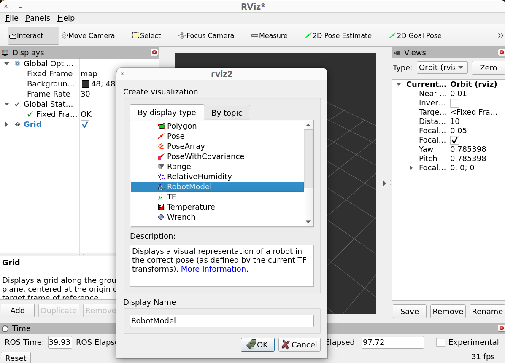
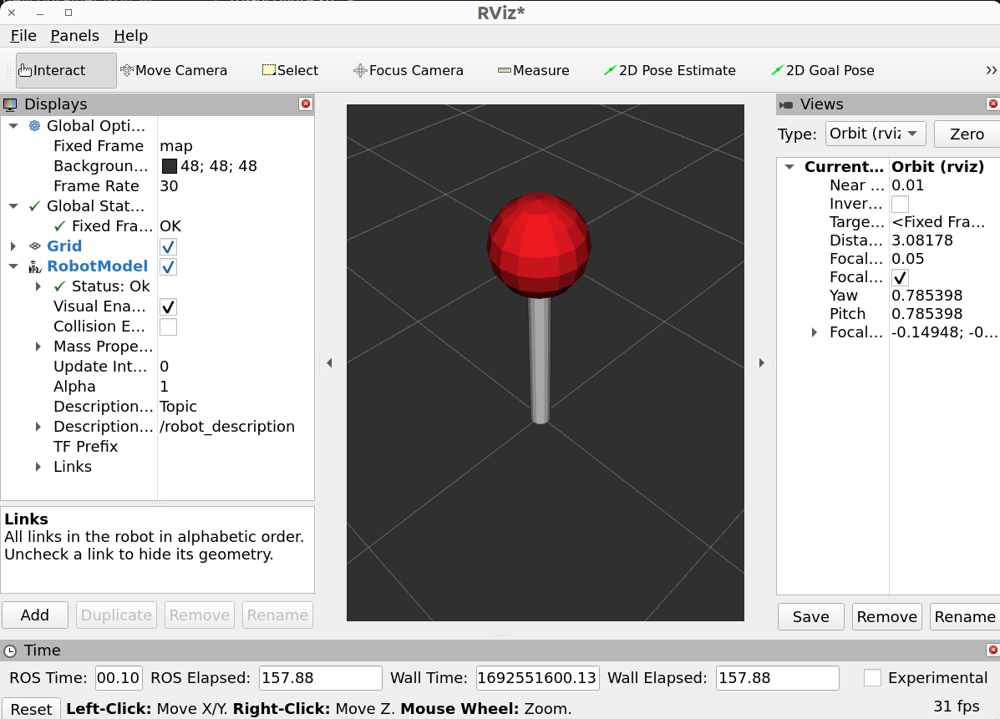

`Inverted Pendulum`
===================

This package serves as a demo inverted pendulum. The pendulum is kept upright by a PID controller.

## Launch

To start the demo, run the following command:

```bash
ros2 launch inverted_pendulum_example demo.launch.py
```

This will start the pendulum simulation. To view the pendulum, start RViz:

```bash
rviz2
```

Add a RobotModel display:




Next, set the description topic to `/robot_description`. You should see the pendulum; it should look like this:



## Interaction

You can interact with the inverted pendulum simulation with [ROS services](https://docs.ros.org/en/humble/Tutorials/Beginner-CLI-Tools/Understanding-ROS2-Services/Understanding-ROS2-Services.html).

### Reset the simulation

You can restart the pendulum simulation via the `/reset_pendulum` service. Below is an example of how to call this service from the terminal. Restarting the simulation will reset the pendulum to its initial state.


```bash
ros2 service call /reset_pendulum std_srvs/srv/Empty
```

### Change the pendulum setpoint

You can change the pendulum setpoint via the `/set_desired_position` service. Below is an example of how to call this service from the terminal. This example sets the desired position for the pendulum to be 0.1 radians, where 0.0 radians is vertical. The setpoint should be between (-pi / 2, pi / 2), as the pendulum is restricted to those limits.

```bash
ros2 service call /set_desired_position inverted_pendulum_interfaces/srv/SetDesiredPosition "{desired_position: 0.1}"
```

### Change the PID constants

You can change the PID constants via the `/set_PID_constants` service. Below is an example of how to call this service from the terminal. This example sets the PID constants all to 0, effectively disabling the control loop.

```bash
ros2 service call /set_PID_constants inverted_pendulum_interfaces/srv/SetPIDConstants "{kp: 0, ki: 0, kd: 0}"
```