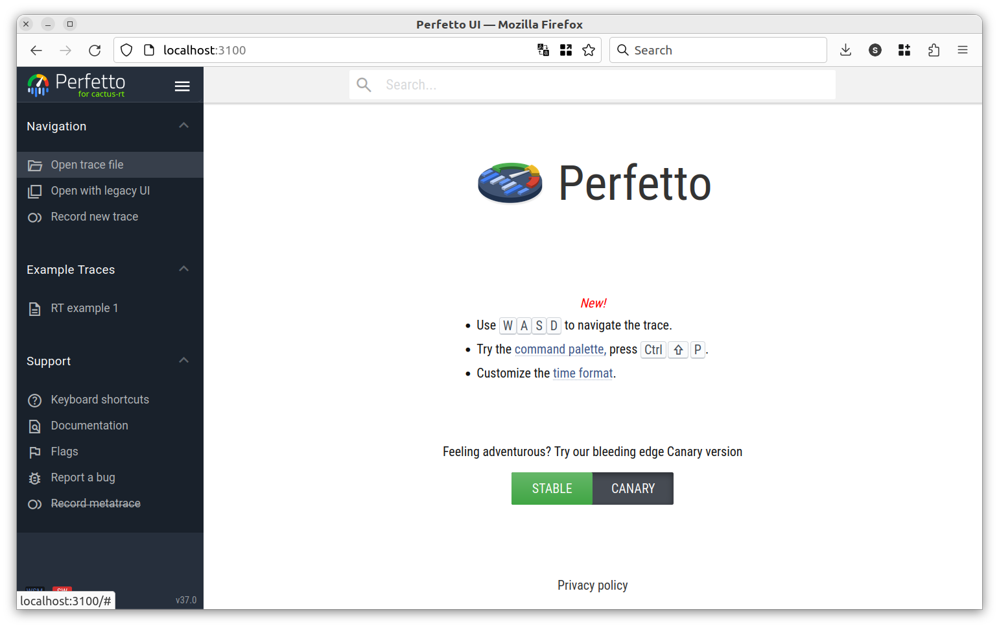

`Real-Time ROS2 Node`
===================

These packages serves as a demo for a real-time node with a timer. The purpose is to demonstrate a real-time publisher with 60Hz.

# Basic Usage

## Build

Change directories to this folder and build:
```bash
cd exercise4-1
colcon build
```

## Launch

If your computer supports graphics, you can run the following command to start the pendulum demo with RViz:

```bash
./run.sh
```

## Stop the example
You should see some warnings. After about 30 seconds, stop the program by pressing CTRL + C.

## Visualization

In a web browser open `http://localhost:3100/` to visualize the trace files. You should see




# Exercise 4-1
This exercise covers how to implement a publisher node in real-time. 

We are using the same application as in exercise 3 with 4 nodes. 


In this exercise we will concentrate on the [Publisher node](./src/camera_demo/src/system_nodes.cc), which publishes the camera image at 60 Hz. We are using a SingleThreadedExecutor for the entire application: 

```
auto camera_node = std::make_shared<ImagePublisherNode>(camera_tracer, 60.0);
auto actuation_node = std::make_shared<ActuationNode>(actuation_tracer);
auto camera_processing_node = std::make_shared<CameraProcessingNode>(object_detector_tracer, data_logger_tracer);

executor.add_node(camera_node);
executor.add_node(camera_processing_node);
executor.add_node(actuation_node);

executor.spin();
```

To demonstrate the interference of other callback delays, we let the data logger run a random execution time between 6ms and 15ms. The publisher shall publish at 60Hz, which is a period of about 17ms. The other nodes together will take 3-4ms also. So in some cases there will be a delay of the publisher callback. 

Let's look at the tracing output in the Perfetto tool. Open the `exercise4-1.perfetto` file and click on `Latency`. Select slice `camera` and `period` in `us`. Your output should look something like
. 


# Solutions and Results

TODO

Example trace files can be found in the [results folder](./results/). For all results, 
...


Solutions for all exercises can be found in the [solutions folder](./solutions/) (`exercise4-1/solutions`). The content of these files can be copy-pasted into the [main.cc](./src/inverted_pendulum/include/inverted_pendulum/message_passing/main.cc) (`exercise2-3/src/inverted_pendulum/include/inverted_pendulum/message_passing/main.cc`) file. The provided solutions file was used to produce the included results.
